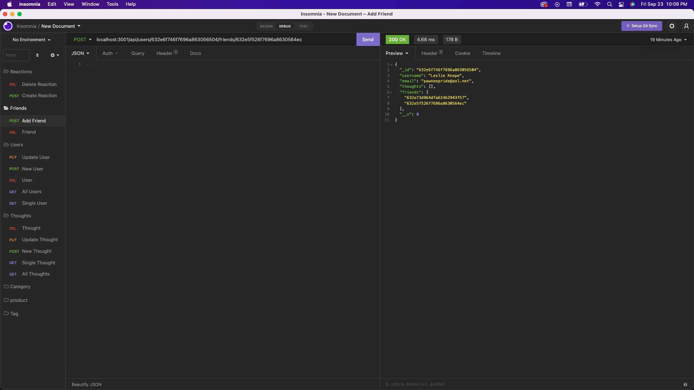

# Social Network

NoSQL API Project

 Social network users can share thoughts, create friends lists, and react to friend's thoughts with this API project.

## Table of Contents

[User Story](#user-story) 
[Project Criteria](#project-criteria) 
[Installation](#installation) 
[Preview](#preview) 
[Questions](#questions)

## User Story

AS A social media startup 
I WANT an API for my social network that uses a NoSQL database 
SO THAT my website can handle large amounts of unstructured data 

## Project Criteria

GIVEN a social network API 
WHEN I enter the command to invoke the application 
THEN my server is started and the Mongoose models are synced to the MongoDB database 
WHEN I open API GET routes in Insomnia for users and thoughts 
THEN the data for each of these routes is displayed in a formatted JSON 
WHEN I test API POST, PUT, and DELETE routes in Insomnia 
THEN I am able to successfully create, update, and delete users and thoughts in my database 
WHEN I test API POST and DELETE routes in Insomnia 
THEN I am able to successfully create and delete reactions to thoughts and add and remove friends to a user’s friend list

## Installation

Start by cloning this repository 
Run `npm i` to download the packages for Express.js, Mongoose, and Moment

## Preview

Please watch the following walkthroughs to see all routes tested 
Video walkthrough [part 1](https://watch.screencastify.com/v/fsMt7i3dMfpHtwSwvFZ8) 
Video walkthrough [part 2](https://watch.screencastify.com/v/m7kH4ibCLtMhGIYssHBv) 

Users API routes
 
GET all & single users, PUT update users, POST create users, DEL delete users

Friends API routes
 
POST add friend, DEL remove friend

Thoughts API Routes
 
GET all & single thoughts, ,PUT update thought, POST create thought, DEL delete thought

Reactions API Routes
 
POST add reaction, DEL remove reaction

MongoDB Users

MongoDB Thoughts

## Questions

If you have questions regarding this project or others you can reach me by: 
Email: kate.epatch@gmail.com 
Github: [katepatch](https://github.com/katepatch)
